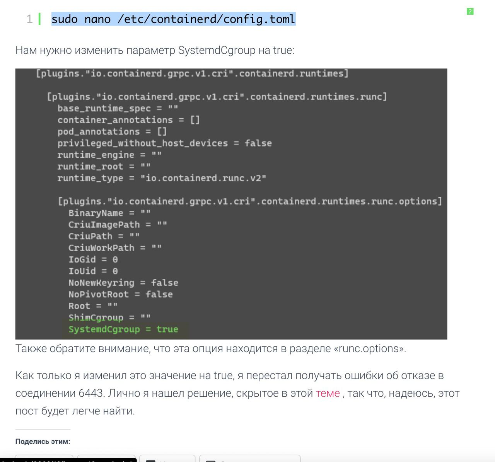
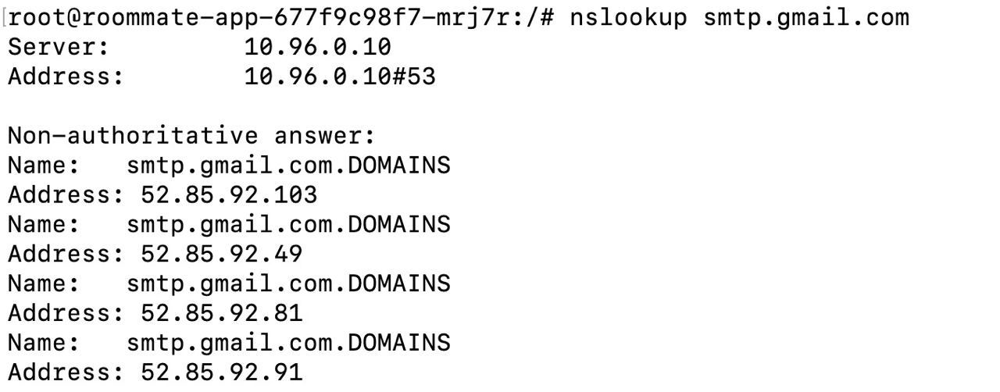
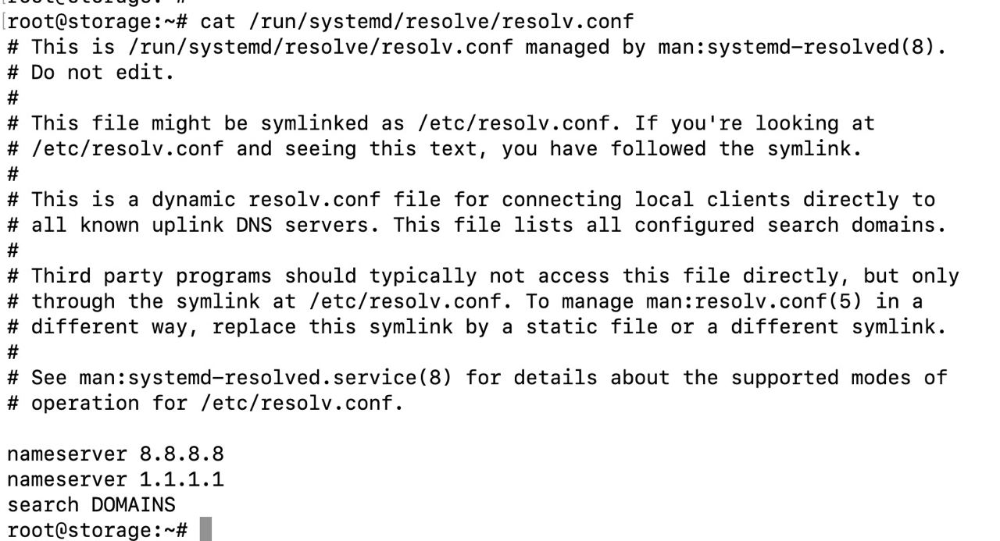

## Установка кластера на чистом железе

https://help.reg.ru/support/servery-vps/oblachnyye-servery/ustanovka-programmnogo-obespecheniya/rukovodstvo-po-kubernetes

### Проблема 1

После установки кластера, будет периодически отвалиться flannel, 
на мастер-ноде невозможно выполнить команды, недоступен 6443 порт

Решение



Затем выполнить:

```
sudo systemctl restart containerd
sudo systemctl restart kubelet
```

### Проблема 2

При попытке доступа в сеть из кластера (в примере попытка доступа к smtp) может возникнуть проблема из-за неверного dns:



В примере к name добавляется .DOMAINS и получается неверный адрес

Необходимо удалить строчку из resolv.conf

```
search DOMAINS
```



После редактирования сохранить и выполнить:

```
sudo systemctl restart kubelet
```

## Установка сервисов в кластер

Перейти в директорию [observability](observability)

Монтируем тома для хранения логов, метрик

```
kubectl apply -f pv-loki-1.yaml
kubectl apply -f pv-loki-2.yaml
kubectl apply -f pv-loki-3.yaml
kubectl apply -f pv-loki-4.yaml
```

Установка подов

```
helm repo add grafana https://grafana.github.io/helm-charts
helm repo update
helm search repo loki
helm install --values values.yaml loki grafana/loki-stack
```

Дождаться ошибки CrashLoopBackOff на поде loki-prometheus-server

Необходимо дать полные права на PVC loki-prometheus-server, затем удалить job

```
kubectl apply -f job.yaml
```

После того как ошибка пропала, нужно удалить job

```
kubectl delete job prometheus-chown-0
```

!!!После выполнения job нужно удалить pod loki-prometheus-server, чтобы он пересоздался!!!!

Чтобы получить данные для входа в графану:

```
kubectl get secret loki-grafana -o go-template='{{range $k,$v := .data}}{{printf "%s: " $k}}{{if not $v}}{{$v}}{{else}}{{$v | base64decode}}{{end}}{{"\n"}}{{end}}'
```

Чтобы удалить loki-stack

```
helm uninstall loki
```

Перейти в директорию [balancer](balancer)

```
helm repo add ingress-nginx https://kubernetes.github.io/ingress-nginx
helm repo update
helm install ingress-nginx ingress-nginx/ingress-nginx

kubectl apply -f ingress.yaml
```

Перейти в директорию [storage](storage)

```
kubectl apply -f secrets.yaml
kubectl apply -f postgres-service.yaml
```

Перейти в директорию [redis](redis)

```
kubectl apply -f redis-service.yaml
```

Перейти в директорию [pgadmin](pgadmin)

```
kubectl apply -f secrets.yaml
kubectl apply -f pgadmin-service.yaml
```

Перейти в директорию [other](other)

```
kubectl apply -f bot-secrets.yaml
kubectl apply -f sender-secrets.yaml
kubectl apply -f jwt-secrets.yaml
```

Перейти в директорию [minio](minio)

```
kubectl apply -f secrets.yaml
kubectl apply -f minio-service.yaml
```

Перейти в директорию [application](application)

```
kubectl apply -f roommate-service.yaml
```

Перейти в директорию [frontend](frontend)

```
kubectl apply -f frontend-service.yaml
```

## Установка cert-manager

Создать отдельный namespace для Cert-Manager

`kubectl create namespace cert-manager`


Добавить helm-репозиторий Jetstack и обновить его
```
helm repo add jetstack https://charts.jetstack.io
helm repo update
```

Установить Cert-Manager в отдельный namespace "cert-mamager". Актуальную версию уточнить в [ArtifactHub](https://artifacthub.io/packages/helm/cert-manager/cert-manager)

`helm install cert-manager jetstack/cert-manager --namespace cert-manager --version v1.13.2 --set installCRDs=true` 


Создать объект типа ClusterIssuer, который будет запрашивать сертификаты у LetsEncrypt:

`nano production_issuer.yaml`


Заполнить поле "email", на который будут приходить уведомления об окончании срока действия сертификатов:

```
apiVersion: cert-manager.io/v1
kind: ClusterIssuer
metadata:
  name: letsencrypt-prod
spec:
  acme:
    # Email address used for ACME registration
    email: your_email_address
    server: https://acme-v02.api.letsencrypt.org/directory
    privateKeySecretRef:
      # Name of a secret used to store the ACME account private key
      name: letsencrypt-prod-private-key
    # Add a single challenge solver, HTTP01 using nginx
    solvers:
    - http01:
        ingress:
          class: nginx
```

Создать объект в кластере кубернетес:

`kubectl apply -f production_issuer.yaml`


Отредактировать манифест Ingress, чтобы связать CertManager и ClusterIssuer с хостами Ingress через Annotation: `annotations.cert-manager.io/cluster-issuer: letsencrypt-prod`. Значение `letsencrypt-prod` берется из манифеста `production_issuer.yaml`: `metadata.name`.  

```
apiVersion: networking.k8s.io/v1
kind: Ingress
metadata:
name: hello-kubernetes-ingress
annotations:
  kubernetes.io/ingress.class: nginx
  cert-manager.io/cluster-issuer: letsencrypt-prod
spec:
  tls:
  - hosts:
    - hw1.your_domain
    - hw2.your_domain
    secretName: ingress-roommate-tls
  rules:
  - host: "hw1.your_domain_name"
    http:
      paths:
      - pathType: Prefix
        path: "/"
        backend:
          service:
            name: service-first
            port:
              number: 80
  - host: "hw2.your_domain_name"
    http:
      paths:
      - pathType: Prefix
        path: "/"
        backend:
          service:
            name: service-second
            port:
              number: 80
```


Статус сертификатов можно посмотреть через команду:

`kubectl describe certificate ingress-roommate-tls`


## Режим debug

```
kubectl port-forward deployment.apps/roommate-app 5005:5005
```